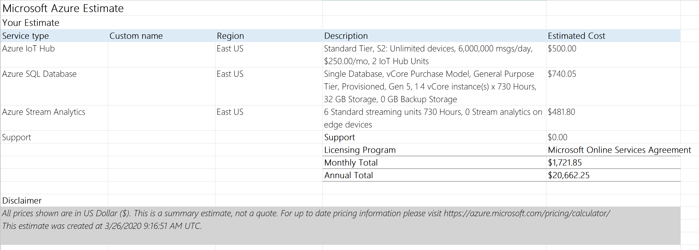

# Cost Analysis and Estimation of Azure IoT Solutions

## 1. Factors of IoT Solution 

1. Data Volume and Frequency
2. Process Complexity and Performance
3. Aggregation Complexity and Performance

Data of the example:

* **100** Devices
* **1** message/second, Message co1000unt per day: **8,640,000**
* message size: **4KB**, Message size per day: 33GB 
 

## 2. Solutions

### Solution 1 <a id="solution1">
| Factor | Level |
| --- | --- |
| Data Volume and Frequency | Medium |
| Process Complexity and Performance | Medium |
| Analysis Complexity and Performance | Medium |

The typical Azure IoT solution architecture. 

#### Architecture Consideration

* Stream Analytics: TODO
* Azure SQL database: TODO

#### Cost Example

https://azure.com/e/4b80638abe1b41d584ce80046beec1a5

### Solution 2 <a id="solution2">

| Factor | Level |
| --- | --- |
| Data Volume and Frequency | Medium |
| Process Complexity and Performance | Medium |
| Analysis Complexity and Performance | Low |

When there is simple visualization requirement at the output data of Stream Analytics.  

#### Architecture Consideration

* Storage Table

#### Cost Example

https://azure.com/e/7305ca1df52d4059924af06a8730fb33

### Solution 3 <a id="solution3">

| Factor | Level |
| --- | --- |
| Data Volume and Frequency | Medium |
| Process Complexity and Performance | Low |
| Analysis Complexity and Performance | Low |

#### Architecture Consideration

* Data Lake Storage: TODO
* Azure Functions: TODO
* Storage Table: TODO

#### Cost  Example

https://azure.com/e/8945b3fc6ba44c6892c6217270c0aa87

If Device Management is not needed, IoT Hub can be replaced by EventHubs.

https://azure.com/e/4e0ca59a036b4c319b19a1707e175a04

### Solution 4 <a id="solution4">

| Factor | Level |
| --- | --- |
| Data Volume and Frequency | High |
| Process Complexity and Performance | Medium |
| Analysis Complexity and Performance | High |

#### Architecture Consideration

* CsomosDB: TODO

#### Cost Model and Example

https://azure.com/e/05f0b2f9e52e437c9df57c0ab03fc3c6

### Solution 5 <a id="solution5">

| Factor | Level |
| --- | --- |
| Data Volume and Frequency | High |
| Process Complexity and Performance | High |
| Analysis Complexity and Performance | High |

#### Architecture Consideration

* Azure Databricks: TODO

#### Cost Example

https://azure.com/e/9e7c3fab3066491f942bf495d0995a67

----------

A calculation tool

https://maye-msft.github.io/azure-iot-cost-calc/

